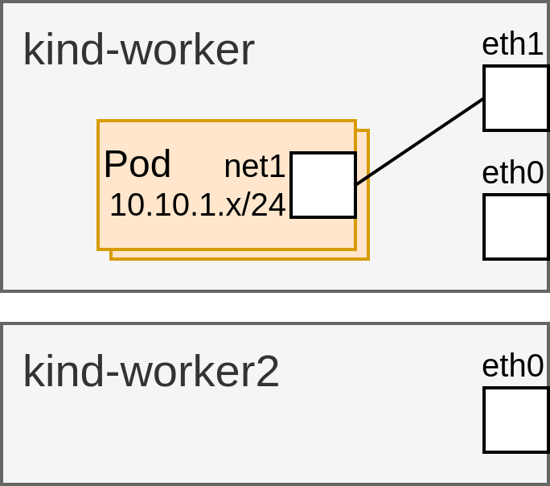

# Demo

This demo showcases a simple use case for the CNI DRA Driver in a non-uniform Kubernetes cluster with two nodes. One node has two network interfaces (eth0 and eth1), while the other has only one (eth0). The scenario demonstrates how a user can deploy pods that require an eth1 interface to create a macvlan interface. It highlights the integration of DRA for scheduling the pod onto the appropriate node, CNI for configuring the network interface, and the ResourceClaim for storing the status of the newly created device.



Set up a registry and build/push the CNI DRA Driver image:
```sh
MY_REGISTRY=localhost:5000/cni-dra-driver
make push-image REGISTRY=$MY_REGISTRY VERSION=latest
(cd ./deployments/cni-dra-driver/ && kustomize edit set image cni-dra-driver=$MY_REGISTRY/cni-dra-driver:latest)
```

Create and prepare a local Kubernetes cluster using Kind:
```sh
# Kind cluster with 2 worker nodes and `DynamicResourceAllocation`, `DRAResourceClaimDeviceStatus` and `DRAAdminAccess` feature gates enabled.
kind create cluster --config docs/demo/kind-config.yaml
# Install CNI Plugins.
kubectl apply -f https://raw.githubusercontent.com/k8snetworkplumbingwg/multus-cni/master/e2e/templates/cni-install.yml.j2
# Create a eth1 on kind-worker.
docker exec -it kind-worker ip link add eth1 link eth0 type macvlan mode bridge
# Deploy the CNI-DRA-Driver.
kubectl apply -k ./deployments/cni-dra-driver/
```

Check that nodes and pods are running:
```sh
kubectl get nodes
kubectl get pods --all-namespaces -o wide
```

Inspect network interfaces on worker nodes:
```sh
docker exec -it kind-worker ip -br link show
docker exec -it kind-worker2 ip -br link show
```

Check the ResourceSlices:
```sh
kubectl get resourceslice
# kind-worker-cni-dra-driver contains the eth0 and eth1 network interfaces.
kubectl get resourceslice kind-worker-cni-dra-driver -o yaml
# kind-worker-cni-dra-driver contains the eth0 network interface.
kubectl get resourceslice kind-worker2-cni-dra-driver -o yaml
```

Apply the deployment manifest:
```sh
kubectl apply -f docs/demo/deployment-template.yaml
```

Check the ResourceClaimTemplate:
```sh
# resourceclaimtemplate requesting eth1 to create a macvlan net1 interface on top of it with an IP from the 10.10.1.0/24 subnet.
kubectl get resourceclaimtemplate macvlan-eth1-attachment -o yaml
```

Check the demo-application deployment:
```sh
# 15 replicas pointing to the macvlan-eth1-attachment resourceclaimtemplate.
kubectl get deployment demo-application -o yaml
```

List and inspect the ResourceClaims:
```sh
# Check a resourceclaim has been created for the 15 replicas.
kubectl get resourceclaim
RESOURCECLAIM=$(kubectl get resourceclaim --no-headers | awk '{print $1}' | head -n 1)
# Check the status of the device that has been created for this pod.
kubectl get resourceclaim -o yaml $RESOURCECLAIM
```

Verify that the demo application pods are deployed on node "kind-worker":
```sh
# Check all the demo-application pods have been scheduled on kind-worker.
kubectl get pods -o wide
POD=$(kubectl get pods --no-headers -l app=demo-application | awk '{print $1}' | head -n 1)
# Check the interface, IP and MAC match the device status in the ResourceClaim.
kubectl exec -it $POD -- ip a
```