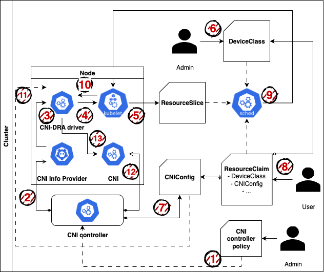

# Architecture

This document outlines the architecture and workflow for integrating dynamic, policy-driven CNI (Container Network Interface) configuration and device allocation using Kubernetes Resource APIs and DRA (Dynamic Resource Allocation). The design aims to enable secure, modular, and flexible network device provisioning without exposing sensitive or complex CNI configuration details directly to end users.

Instead of allowing users to define low-level CNI configurations within their ResourceClaim, this architecture introduces a layered model where administrators and controllers manage device discovery, configuration, and CNI plugin integration. The system leverages custom resources such as CNIConfig, DeviceClass, and ResourceSlice, along with a CNI DRA driver and an info provider component, to facilitate controlled and automated CNI operations as shown below.

The following steps detail the complete lifecycle—from policy definition and device registration to CNI configuration generation and execution—ensuring both control and flexibility across administrative and user domains.

1. The admin defines a CNI controller policy.  
2. The CNI controller deploys the CNI and its info provider to the node.  
3. The CNI info provider registers custom devices (with attributes and capacities) with the CNI DRA driver.  
4. The CNI DRA driver integrates the network device information and notifies the kubelet.  
5. The kubelet publishes the corresponding `ResourceSlice`.  
6. The admin defines a `DeviceClass` based on the published device in the `ResourceSlice`.  
7. The CNI controller defines a `CNIConfig`, which the admin can modify based on the policy defined in Step 1.  
8. The user creates a `ResourceClaim` specifying the desired `DeviceClass`, `CNIConfig`, and other request parameters such as the number of devices, attribute selectors, and capacity requirements.  
9. The DRA scheduler selects a device that satisfies the requirements and allocates it to the user-defined `ResourceClaim`, notifying the kubelet.  
10. The kubelet calls the CNI DRA driver to prepare the device resource.  
11. The CNI DRA driver retrieves and processes the `CNIConfig` to generate the final CNI configuration.  
12. The CNI DRA driver invokes the CNI plugi, deployed in the Step 2, and returns results to the kubelet.

> [!NOTE]
> For CNI plugins that are manually deployed to the node without using a CNI controller, steps 1 to 3 and step 12 are skipped.
> In this case, the administrator is responsible for directly defining the CNIConfig used in step 7.
